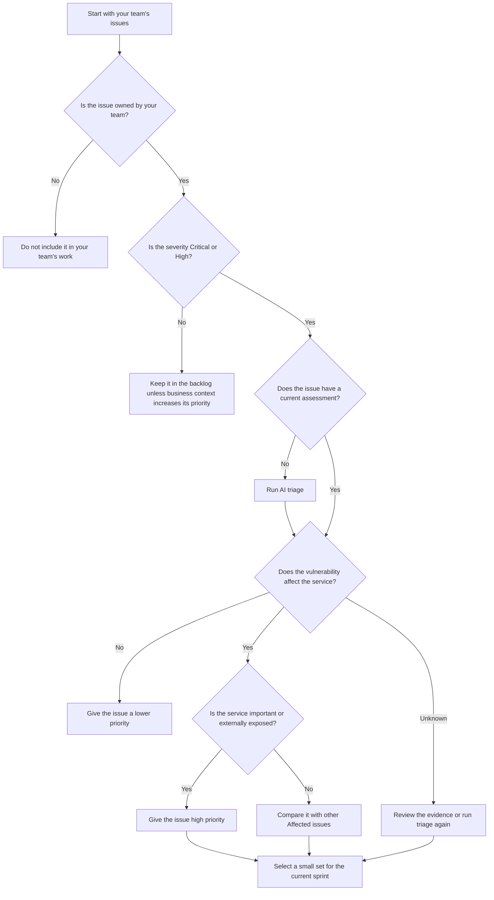
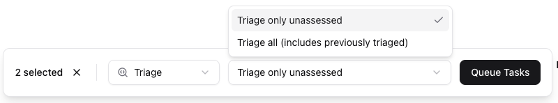

# PulseOwl Vulnerability Prioritisation Playbook

## Select What to Work On

### Purpose

Use this playbook to select the PulseOwl security vulnerability issues that your team should tackle first.

Important: Do not try to resolve the complete backlog all at once. Start with a small set of important issues. Then work through the backlog in priority order.

Ask yourself: **“What are the 2–3 genuinely important issues for my team to address this sprint?”**

### Prioritisation rule

**Do not use issue severity alone to set priority.** Use these factors together:

- **Ownership:** Is the affected service owned by your team?
- **Severity:** Is the issue Critical or High severity?
- **Assessment:** Does the vulnerability affect the service? (you can run AI triage to find out)
- **Service importance:** How important is the service to the business?
- **Exposure:** Is it connected to a public network? Can users or external systems reach the vulnerable code?

An **Affected** High-severity vulnerability can have a higher priority than a Critical-severity vulnerability that does **Not Affect** the service.

If an issue does not have an assessment, run AI triage before you make the final priority decision.

### Prioritisation decision tree

The next page displays a decision tree to follow for prioritising work.

### Recommended workflow

**1. Select the scope.** Start with your team or one service.

**2. Select the important severities.** Start with Critical and High issues.

**3. Assess the vulnerabilities.** Run AI triage from PulseOwl for issues that do not have a useful current assessment (see next section).

**4. Remove noise from the immediate work list.** Give lower priority to vulnerabilities that do not affect the service.

**5. Compare the affected issues.** Consider severity, service importance, and exposure.

**6. Select a small work set.** Choose the issues that the team can reasonably address in the current sprint.

### Example

`carrier-gateway` has two severity vulnerabilities, one is Critical-severity and the other is High-severity.

- High-severity vulnerability A is **Service Affected**.
- Critical-severity vulnerability B is **Service Not Affected**.

Work on Vulnerability A first, unless other business information changes the priority.

The security severity might be critical on vulnerability B, but there is no chance of exploit according to AI assessment. The assessment result changes the work priority.

> [!TIP]
> Use severity to find candidate issues in the [Issues Explorer](https://app.pulseowl.dev/issues). Use assessment and business context to decide what to work on.

## Triage, Act, and Close

### Use PulseOwl to narrow the work

Use the **Issues Explorer** to find the issues that your team must review. To access the Issues Explorer [click here](https://app.pulseowl.dev/issues).

1. Filter by **Team** or **Service**.
2. Filter by **Severity** if necessary.
3. Select the issues that need assessment. Click the checkboxes in the issue rows. A panel will appear.
4. Use **Bulk Issue Triage** to assess multiple security vulnerabilities. Select **Triage** and **Triage only unassessed**, then click **Queue Tasks**. A confirmation dialog will appear.

   

5. AI assessment usually takes about 20 minutes. The results are available in the issue details. More detailed information is available on the **Task Runs** page. To view task run statuses, [open the Task Runs page](https://app.pulseowl.dev/tasks).
6. Review the assessment results before you select remediation work.

PulseOwl continues to monitor new issues. It can also automatically triage new Critical and High security issues when the monitoring rules apply.

For older backlog issues, use Bulk Issue Triage to assess multiple issues at one time.

#### Interpret the assessment result

| Assessment result        | Meaning                                                                              | Recommended action                                                                          |
| ------------------------ | ------------------------------------------------------------------------------------ | ------------------------------------------------------------------------------------------- |
| **Service Affected**     | The vulnerable condition applies to the service.                                     | Review the evidence. Give the issue priority based on severity and business context.        |
| **Service Not Affected** | PulseOwl found evidence that the vulnerable condition does not apply to the service. | Give the issue a lower priority. Review it again if the service or dependency changes.      |
| **Unknown**              | PulseOwl does not have enough evidence to determine the result.                      | Review the evidence gathered by PulseOwl. At this point, investigate manually if necessary. |

> [!NOTE]
> Do not treat an assessment result as a overall severity score. Use the assessment result together with issue severity, service importance, and exposure.

### Act on an affected issue

For an issue with the result **Service Affected**:

1. **Confirm ownership.** Confirm that your team maintains the affected service.
2. **Review the assessment evidence.** Open the issue details. Select **Related Task Run → View Task** to see the full assessment. Review the factors that PulseOwl considered, such as:
   - Is the package installed?
   - Is the package used at runtime?
   - Is the vulnerable code reachable?
   - Is the vulnerability exploitable?
3. **Set the priority.** Use the prioritisation framework on Page 1 to decide if the issue must enter the current sprint.
4. **Create the remediation work.** Add the work to your normal engineering workflow. For example, create a ticket in your project management system.
5. **Apply the fix.** Upgrade the affected package or change the code to protect the service from the vulnerability.
6. **Deploy the fix.** Deploy the change to production through your normal deployment process.
7. **Confirm resolution.**
   - If you upgraded the vulnerable package, Dependabot will detect the fixed version and close the alert. PulseOwl will sync this change and close the related issue.
   - If you changed the code so that the vulnerability no longer affects the service, run **Re-triage** in PulseOwl. Confirm that the new assessment result is **Service Not Affected**. You can also dismiss the related Dependabot alert manually when appropriate.

As you can see, the fix can include a dependency upgrade, configuration change, runtime upgrade, code change, or other maintenance action.

### Quick operating rule

> [!TIP]
> Find the issues for your team. Assess before you prioritise. Work on the affected issues first. Confirm the result before you close the issue.
